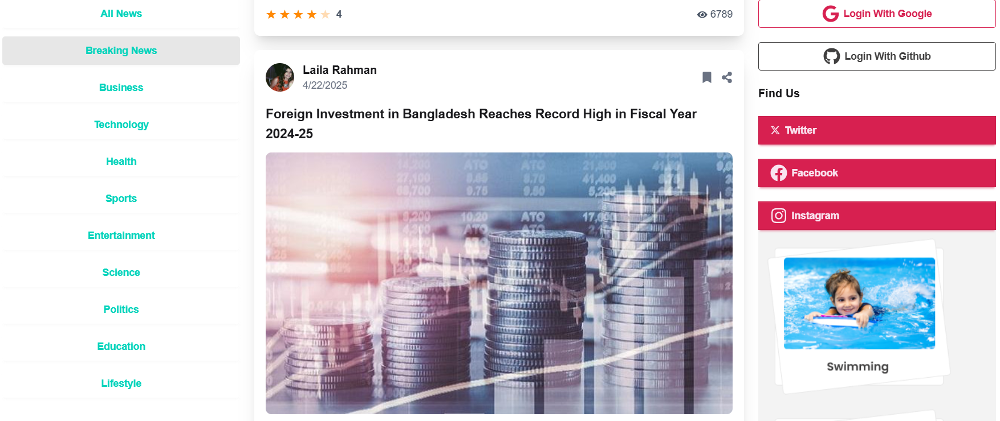
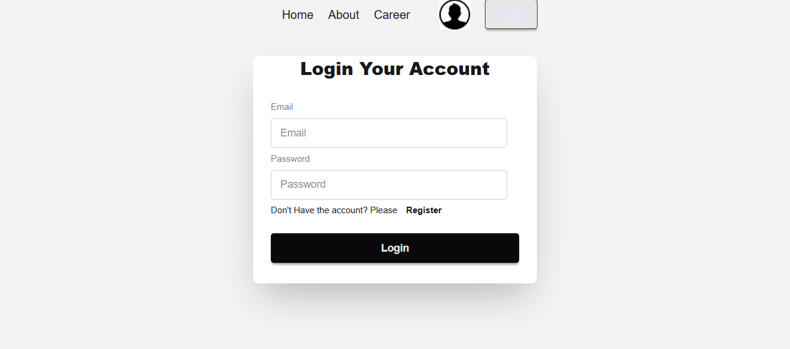
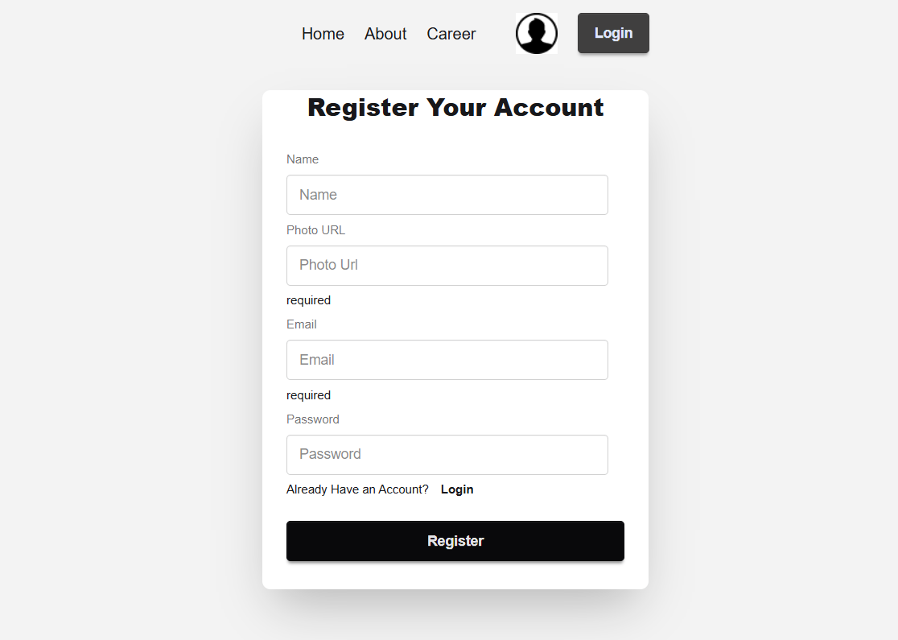

Live Site :  https://news-portal-auth-f5cdd.web.app/category/1
Screen Shots:

1.


# 📰 NewsSphere — Modern News Portal

![Vite]https://vite.dev/guide/
![React] https://react.dev/
![TailwindCSS]https://tailwindcss.com/
![Firebase]https://console.firebase.google.com/u/0/project/news-portal-auth-f5cdd/overview?fb_gclid=Cj0KCQjwrojHBhDdARIsAJdEJ_eivaJkXb8OYnUc45dmMbmfj9_ld_jOJyzs2t8-Mlr6JyaPtM-RctwaAoZyEALw_wcB


## 📖 Overview

**NewsSphere** is a modern, responsive **News Portal** built using **React**, **Vite**, **Tailwind CSS**, and **Firebase**.  
It delivers categorized news such as **Politics**, **Technology**, **Entertainment**, **Sports**, and more — all dynamically fetched and displayed with a smooth UI.

Users can preview news headlines without logging in, but must **sign in** to read the **full articles**, ensuring engagement and user management through **Firebase Authentication**.

---

## 🚀 Features

✅ Responsive and modern UI with Tailwind CSS  
✅ Categorized news sections (Politics, Tech, Entertainment, etc.)  
✅ Firebase Authentication (Sign Up / Login / Logout)  
✅ Conditional access — only logged-in users can read full articles  
✅ Fast build setup using Vite  
✅ Reusable React components and modular architecture  
✅ Optimized performance and mobile-first design  

---

## 🧰 Tech Stack

| Category | Technology |
|-----------|-------------|
| **Frontend** | React + Vite |
| **Styling** | Tailwind CSS |
| **State Management** | React Hooks / Context API |
| **Backend & Auth** | Firebase Authentication |
| **Deployment** | Vercel / Netlify / Firebase Hosting |
| **Language** | JavaScript (ES6+) |

---

## 🧑‍💻 Project Structure
news-portal/
├── public/
│ └── index.html
├── src/
│ ├── assets/
│ ├── components/
│ │ ├── Navbar.jsx
│ │ ├── NewsCard.jsx
│ │ ├── CategoryList.jsx
│ │ └── ProtectedRoute.jsx
│ ├── pages/
│ │ ├── Home.jsx
│ │ ├── Login.jsx
│ │ ├── Register.jsx
│ │ └── NewsDetails.jsx
│ ├── context/
│ │ └── AuthContext.jsx
│ ├── firebase/
│ │ └── firebase.config.js
│ ├── App.jsx
│ ├── main.jsx
│ └── index.css
├── .env
├── package.json
├── tailwind.config.js
└── vite.config.js


---

## ⚙️ Installation & Setup

Follow these steps to run the project locally:

### 1️⃣ Clone the Repository
```bash
git clone https://github.com/Rahaman-Atikur/News-Portal-auth
cd news-portal-auth


cd news-portal
2️⃣ Install Dependencies
bash
Copy code
npm install
3️⃣ Set Up Firebase
Create a new Firebase project at Firebase Console.
Then enable Email/Password Authentication under the Authentication tab.

4️⃣ Configure Environment Variables
Create a .env file in the root directory and add your Firebase configuration:

bash
Copy code
VITE_API_KEY=your_api_key
VITE_AUTH_DOMAIN=your_auth_domain
VITE_PROJECT_ID=your_project_id
VITE_STORAGE_BUCKET=your_storage_bucket
VITE_MESSAGING_SENDER_ID=your_sender_id
VITE_APP_ID=your_app_id
Make sure not to commit your .env file.

5️⃣ Run the Development Server
bash
Copy code
npm run dev
6️⃣ Build for Production
bash
Copy code
npm run build
🔐 Authentication Flow
Users must sign in using Firebase Authentication to view full news articles.

Non-authenticated users can only see news previews.

Auth state is managed using React Context and Firebase’s onAuthStateChanged listener.

Screenshots:!





